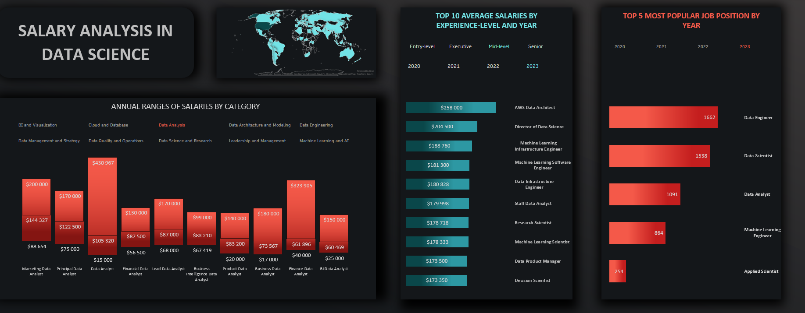

# Project Overview
The "Salary Analysis in Data Science" is an Excel dashboard designed to provide insights into the salary ranges within the data science industry. This dashboard aims to assist users in understanding salary distributions, top-paying job titles, and popular roles in the field over time, enabling data-driven career decisions.

## Dashboard Visualizations
This Excel dashboard includes a couple of charts that offer a breakdown of salary data, such as:

### 1. Annual Ranges of Salaries by Category
- **Chart Type:** Stacked Column Chart
- **Description:** This chart displays the annual salary ranges across different job positions by category within data science.
- **Slicer:** Job Category

### 2. Top 10 Average Salaries by Experience Level and Year
- **Chart Type:** Clustered Bar Chart
- **Description:** This chart shows the 10 highest average salaries based on experience level and selected years.
- **Slicers:** Experience Level and Year

### 3. Top 5 Most Popular Job Positions by Year
- **Chart Type:** Clustered Bar Chart
- **Description:** This visualization showcases the top 5 most popular job titles in data science in different years.
- **Slicer:** Year

## Key Metrics
- **Minimum, Maximum, and Median Salary:** Used to represent the range of salaries in each job position by different categories.
- **Average Annual Salary:** Used to represent the top 10 best-paid job positions.
- **Count of Occurrence of Each Job Position:** Used to represent the top 5 most popular job positions in different years.

## Summary
This Excel dashboard is a user-friendly tool created to visualize complex salary data in an accessible format. It's designed to assist professionals and job seekers in making informed decisions about their careers in data science based on detailed salary information.

## Source
Dashboard based on [dataset](https://www.kaggle.com/datasets/hummaamqaasim/jobs-in-data) from kaggle.com

## Usage
To explore this dashboard:

1. **Download the Excel file.**
2. **Open the file using Microsoft Excel.**
3. **Use the slicers and filters:** Adjust the slicers to filter and explore data based on categories, job titles, or experience levels.
